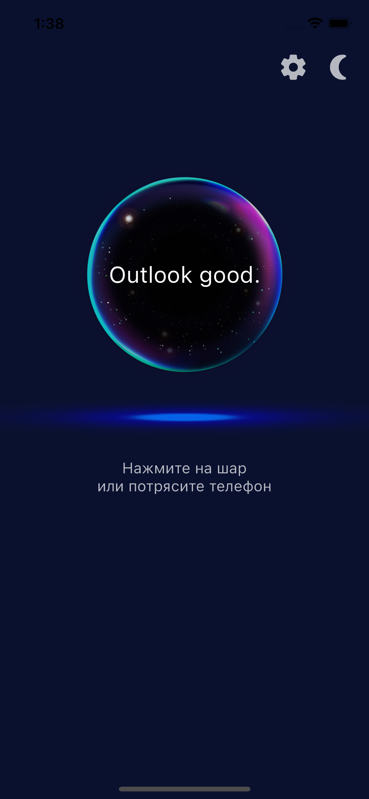
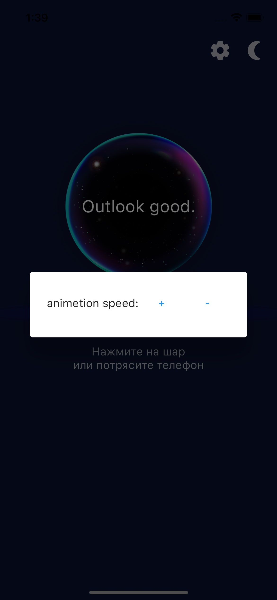
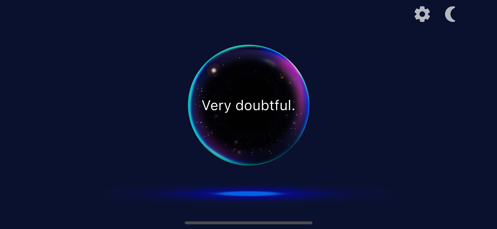
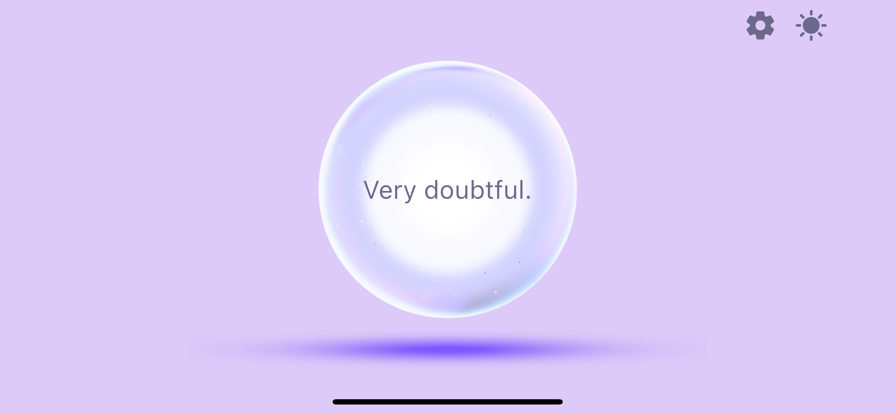

# Целевая платформа

Web

# Результаты

- Начальный экран с шаром
- По нажатию на шар отправляется запрос к API
- Адаптация для запуска на web
- Смена темы с помощью ChangeNotifierProvider
- Отправка запроса по тряске телефона
- Анимация внутри шара при появлении ответа

# Ссылки на демонстрацию работы/скриншоты

https://github.com/DariaKatyaevaa/surf-flutter-study-jam-4/blob/main/docs/assets/magic_ball.mov

https://github.com/DariaKatyaevaa/surf-flutter-study-jam-4/assets/49954825/8ec64e29-ed54-41f1-a1c6-09f6109d42bd

https://github.com/DariaKatyaevaa/surf-flutter-study-jam-4/blob/main/docs/assets/magic_ball2.mov

https://github.com/DariaKatyaevaa/surf-flutter-study-jam-4/assets/49954825/db5b0117-17e3-4829-b8b5-b7cf6ccfa267

<video src="../assets/magic_ball.mov" width="400"></video>

<video src="../assets/magic_ball2.mov" width="400"></video>

   

   

